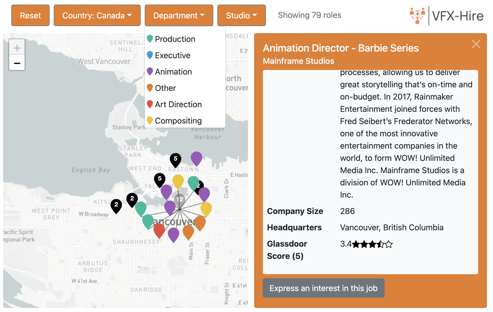
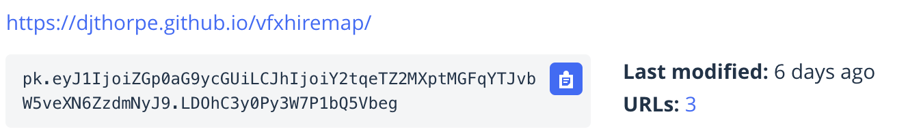
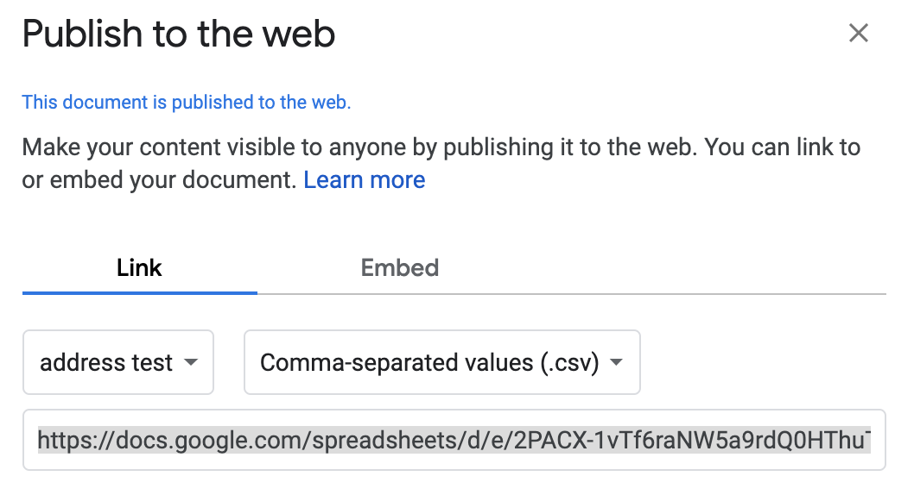

# VFX Hire Map

An example of how to use the Leaflet API with Mapbox in
order to provide job positions on a map.



## Development

Clone the repository and then run the following to develop locally:

```bash
git clone git@github.com:djthorpe/vfxhiremap
open http://localhost:8000/vfxhiremap/
python3 -m http.server
```

There are the following folders and files:

  * `css` includes CSS sources. Bootstrap is loaded from a CDN;
  * `img` contains SVG icons for the markers;
  * `js` includes the CSS. The `app.js` file bootstraps the application and
    contains the controlling class, the `data.js` contains the models, `geocode.js` converts an address into a country and `view.js` contains the views.
  * `iframe.html` is an example of how to embed the map;
  * `index.html` is the main application scaffold.

Requires a browser that supports ES5. Should mostly work on Safari, IE and Chrome
but probably needs some more extensive testing.

## Implementation

All the changes you will need to make for implementation are in the `app.js` file:

```js
const SPREADSHEET_CSV = "https://docs.google.com/spreadsheets/d/e/2PACX-1vTf6raNW5a9rdQ0HThuTnVAssnSxe3ZWDGDoz3CaAkC8g-fGRZBWOk5_7_3lqGVsiaeIxe5of8r38L1/pub?gid=1805947673&single=true&output=csv";
const MAPBOX_TOKEN = "pk.eyJ1IjoiZGp0aG9ycGUiLCJhIjoiY2tqeTZ2MXptMGFqYTJvbW5veXN6ZzdmNyJ9.LDOhC3y0Py3W7P1bQ5Vbeg";
const TILE_URL = "//api.mapbox.com/styles/v1/{id}/tiles/{z}/{x}/{y}?access_token={accessToken}";
const ROOT_URL = "/vfxhiremap";
```

Sign up for an account with [mapbox](https://www.mapbox.com/) and obtain
an [access token](https://account.mapbox.com/access-tokens/). Make sure this
is limited so that requests can only be made from the origination URL,
the variable to add this to is `MAPBOX_TOKEN`. Here's an example of how this
should look:



You need to publish your spreadsheet as a CSV in Google Docs ("File" > "Publish to Web") and put the publish
URL in the `SPREADSHEET_CSV` variable. Here is an example of how this looks:



Implement the code in this repository on a hosted website. I recommend
[GitHub pages](https://pages.github.com/). The `ROOT_URL` should be changed
to reflect where the application is being served.

Embed the map on your main website through an `<iframe>`. For example, here
is an example which uses bootstrap for styling:

```html
<!DOCTYPE html>
<html>
<head>
    <title>VFX Hire | IFrame Demo</title>
    <link href="//cdn.jsdelivr.net/npm/bootstrap@5.0.0-beta1/dist/css/bootstrap.min.css" rel="stylesheet">
</head>

<body>
<div class="container m-2 border rounded">
    <h1 class="h1">Embed the map</h1>
    <div class="ratio ratio-16x9">
        <iframe src="//djthorpe.github.io/vfxhiremap/" class="col"></iframe>
    </div>
</div>
</body>
```

## Spreadsheet Format

Your spreadsheet should at a minimum have a header to identify the rows and include the following rows. Additional rows can be added, and are displayed in the "details" pain in order of spreadsheet columns:

| Column Name | Notes |
|-------------|-------|
| Job Number | Identifier which needs to be populated
| Job Department | Required for filtering
| Studio | Required for filtering
| Location of Job | Required for filtering. Country is interpreted from city or country
| Latitude | Required for marker. Potentially can be automated later
| Longitude | Required for marker. Potentially can be automated later
| Studio | Required for filtering
| Job Status | Keyword "Live" in this cell is required for display, otherwise not included on map

When you change the data on your spreadsheet, as long as you are automatically publishing, it should be reflected automatically on the map.

## References

The following sources & dependencies were used in construction of this application:

  * [Bootstrap](https://getbootstrap.com/docs/5.0/) for views and UI;
  * [Mapbox](https://www.mapbox.com/) for map tiles;
  * [Leaflet](https://leafletjs.com/reference-1.7.1.html) for map implementation;
  * [Leaflet.markercluser](https://github.com/Leaflet/Leaflet.markercluster) for Clustering markers;
  * [Papaparse](https://www.papaparse.com/docs) for CSV parsing;
  * [Github pages](https://pages.github.com/) for hosting;
  * [Google Spreadsheets](https://support.google.com/docs/answer/183965) for publishing CSV.

The links above should go through to reference material.


